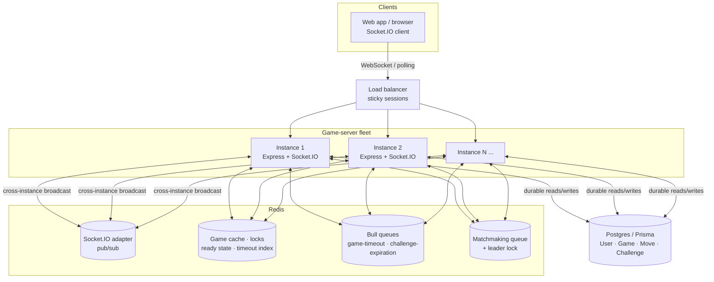
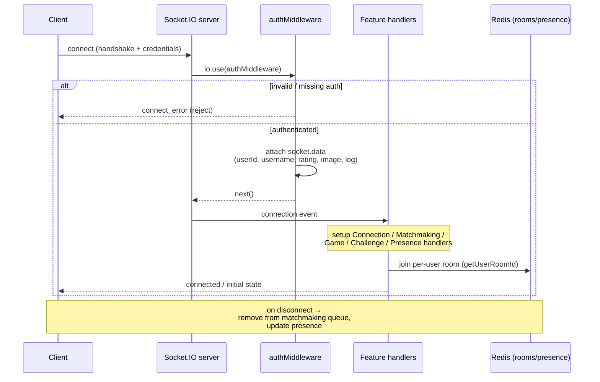
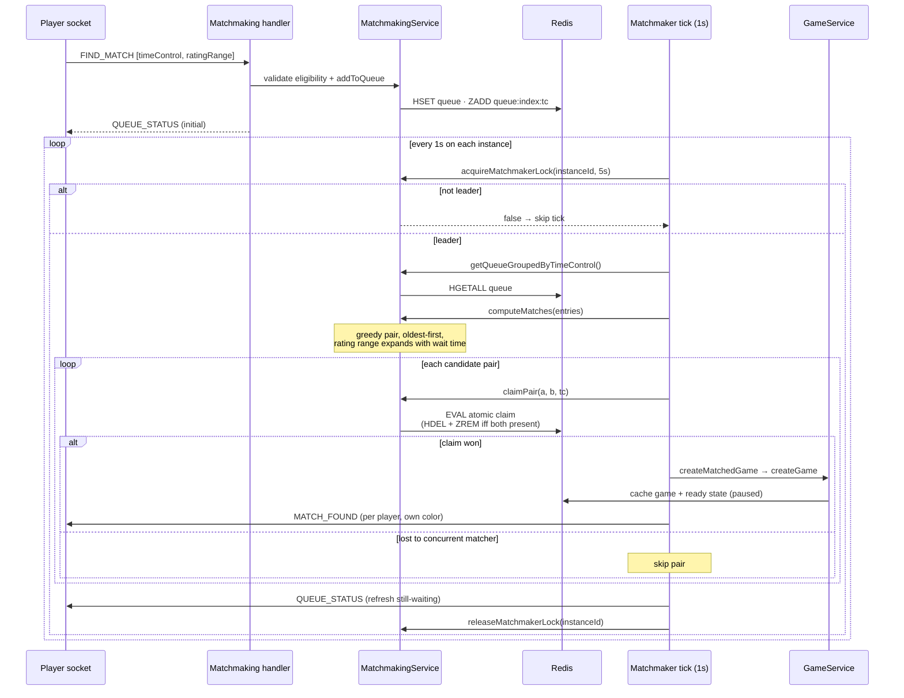
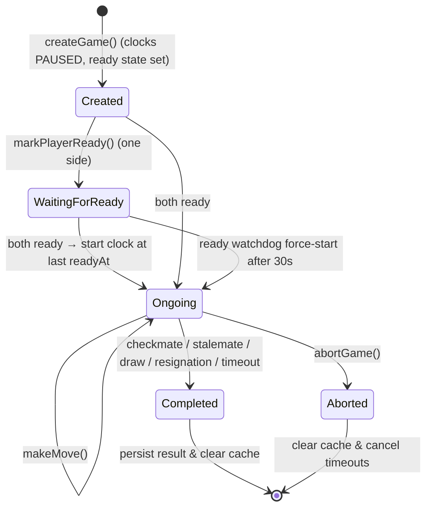
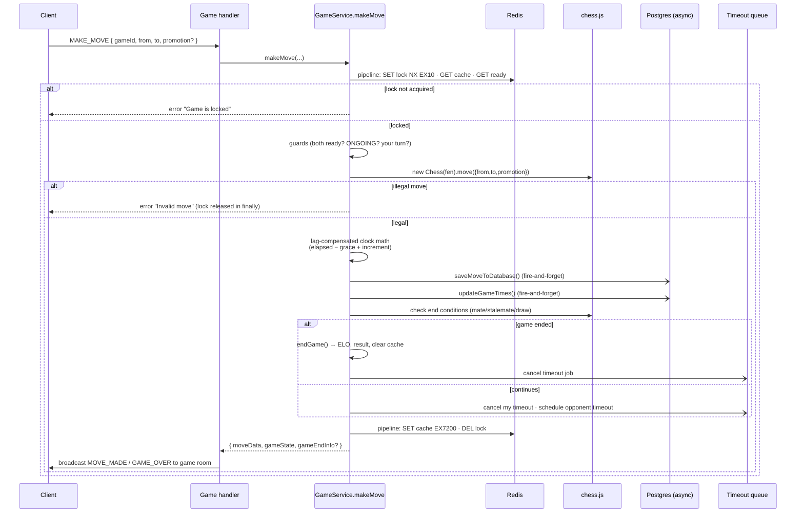
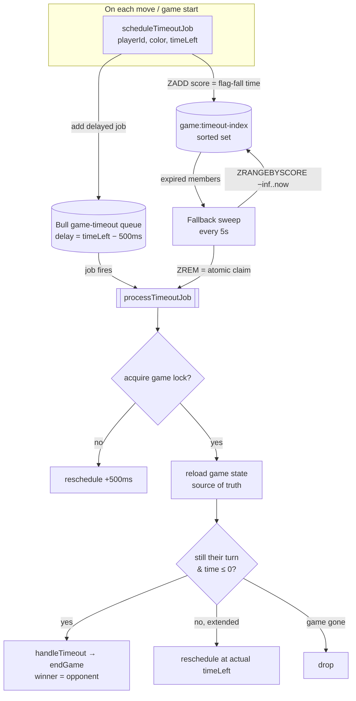
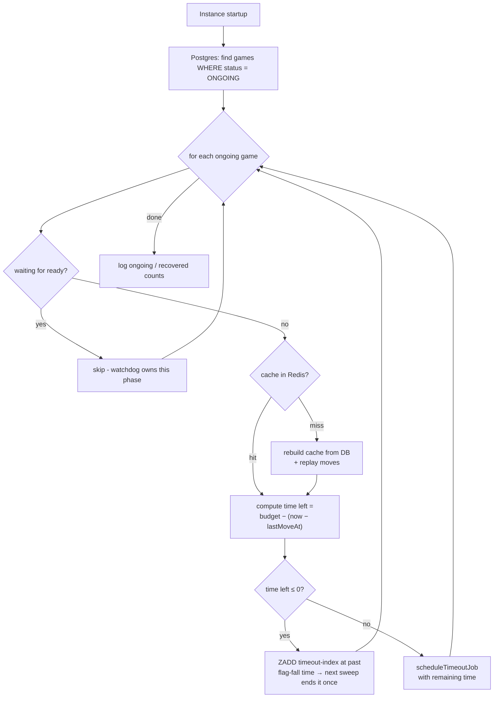
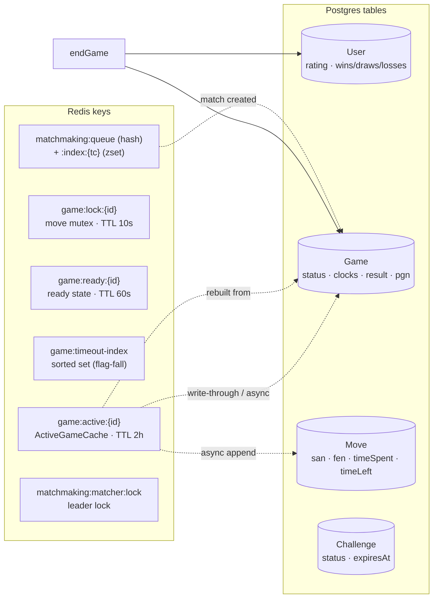

# Game Server Architecture

Realtime chess backend: a single Express + Socket.IO process (sharing one HTTP
port) that runs **multi-instance** in production. **Redis** is the coordination
layer (Socket.IO adapter, game cache, distributed locks, Bull queues, matchmaking
queue) and **Postgres (via Prisma)** is the durable source of truth.

The diagrams below are grouped from the outside in: topology first, then the
socket lifecycle, then the four subsystems where the real complexity lives -
matchmaking, the game/move hot path, the clock/timeout system, and crash
recovery.

- [Game Server Architecture](#game-server-architecture)
  - [1. System context \& deployment](#1-system-context--deployment)
  - [2. Socket connection \& auth lifecycle](#2-socket-connection--auth-lifecycle)
  - [3. Matchmaking flow](#3-matchmaking-flow)
  - [4. Game lifecycle state machine](#4-game-lifecycle-state-machine)
  - [5. Make-a-move hot path](#5-make-a-move-hot-path)
  - [6. Clock \& timeout architecture](#6-clock--timeout-architecture)
  - [7. Crash \& startup recovery](#7-crash--startup-recovery)
  - [8. Data \& caching model](#8-data--caching-model)

---

## 1. System context & deployment

Clients hold a Socket.IO connection to one instance behind the load balancer. The
Redis **adapter** pub/sub is what makes a broadcast on instance A reach a socket
connected to instance B - which is why Redis is mandatory in production
([socket-server.ts](apps/game-server/src/socket/socket-server.ts) throws if it is unreachable
when `NODE_ENV=production`).

**Durability split:** anything in Redis is ephemeral and reconstructable; the
cache carries a `game:active:*` TTL of 2 hours. Postgres is authoritative and is
what [`recoverActiveGames()`](apps/game-server/src/socket/services/game.ts) reconciles from on
startup (see [Section 7](#7-crash--startup-recovery)).

---

## 2. Socket connection & auth lifecycle

Every connection passes through `authMiddleware` before any handler is wired up.
Handlers are registered by feature module in
[socket-server.ts](apps/game-server/src/socket/socket-server.ts).

The per-user room (`getUserRoomId(userId)`) is how server-side events -
`MATCH_FOUND`, `CHALLENGE_EXPIRED`, etc. - are addressed to a specific player
regardless of which instance they landed on.

---

## 3. Matchmaking flow

One centralized loop ticks every second on each instance, but only the instance
holding the Redis **leader lock** actually runs a matching pass, so the fleet
does not duplicate work or double-emit `QUEUE_STATUS`. The atomic `claimPair`
Lua script is the ultimate safety net if two matchers ever overlap.
Source: [handlers/matchmaking.ts](apps/game-server/src/socket/handlers/matchmaking.ts),
[services/matchmaking.ts](apps/game-server/src/socket/services/matchmaking.ts).

A separate 30s interval runs `cleanup()` to evict entries older than the 2-minute
max wait.

---

## 4. Game lifecycle state machine

A game is created with clocks **paused** and only starts ticking once both
players signal ready - or the ready-watchdog force-starts it after 30s (which
penalizes the slow loader). Source: [services/game.ts](apps/game-server/src/socket/services/game.ts).

On any terminal transition, `endGame()` writes the result + PGN, applies ELO
changes, increments W/D/L counters (for the leaderboard), cancels pending timeout
jobs, and removes the Redis cache.

---

## 5. Make-a-move hot path

The most latency-sensitive and most subtle path. Two Redis pipelines bracket the
work (one to lock+load, one to write+unlock), chess.js validates, clocks are
lag-compensated, and DB writes are fired **off the response path**.
Source: [services/game.ts `makeMove()`](apps/game-server/src/socket/services/game.ts).

Key design points:

- **Lock TTL is 10s** - a crashed handler self-heals; the lock is also deleted in
  a `finally` on every error path.
- **DB writes never block the move response** - the Redis cache is the realtime
  source of truth; Postgres catches up asynchronously.
- **Timeout (re)scheduling is fire-and-forget housekeeping** - `processTimeoutJob`
  re-validates under its own lock, so a lost scheduling call is corrected by the
  sweep ([Section 6](#6-clock--timeout-architecture)).

---

## 6. Clock & timeout architecture

Flag-fall is enforced by **three overlapping mechanisms** that all funnel through
one re-validating `processTimeoutJob` (which runs under the game lock). No single
mechanism is trusted on its own.

Why three layers:

- **Bull delayed job** - the primary, precise trigger.
- **`game:timeout-index` sorted set** - lets any instance find an overdue flag
  even if the Bull job was never added or got dropped. The **`ZREM` acts as an
  atomic claim** so exactly one instance processes each expiry.
- **5s fallback sweep** - `O(expired)`: only entries past their score are
  returned, so healthy games cost nothing per tick.

`processTimeoutJob` always **re-checks actual game state** before flagging, so
races with an in-flight move (which extends the clock via increment) resolve
correctly - it reschedules instead of ending the game.

---

## 7. Crash & startup recovery

Runs on **every** instance at boot, so it must be idempotent and must never end a
game directly (ending is only race-safe behind the sweep's `ZREM` claim + game
lock). Covers total Redis loss. Source:
[`recoverActiveGames()`](apps/game-server/src/socket/services/game.ts).

The startup path deliberately **hands already-expired games to the sweep** rather
than calling `endGame` inline - that keeps "end this game" flowing through the
single claim-protected path even across a fleet-wide restart.

A parallel startup step, `cleanupExpiredChallenges()`
([challenge.queue.ts](apps/game-server/src/queues/challenge.queue.ts)), expires any PENDING
challenges whose deadline passed while the server was down and notifies both
parties.

---

## 8. Data & caching model

What lives where, and how the two stores relate. Redis holds hot, ephemeral
coordination state; Postgres holds the durable record.

Relationships:

- `game:active:{id}` is the realtime truth during play; `Game`/`Move` rows are
  written **asynchronously** off the move path and are what the cache is _rebuilt
  from_ on recovery.
- `endGame` is the one place that writes final `Game` result fields and mutates
  `User` rating + W/D/L counters (denormalized for the leaderboard).
- Everything under `matchmaking:*` and the lock keys is pure coordination state
  with no durable counterpart - safe to lose.
